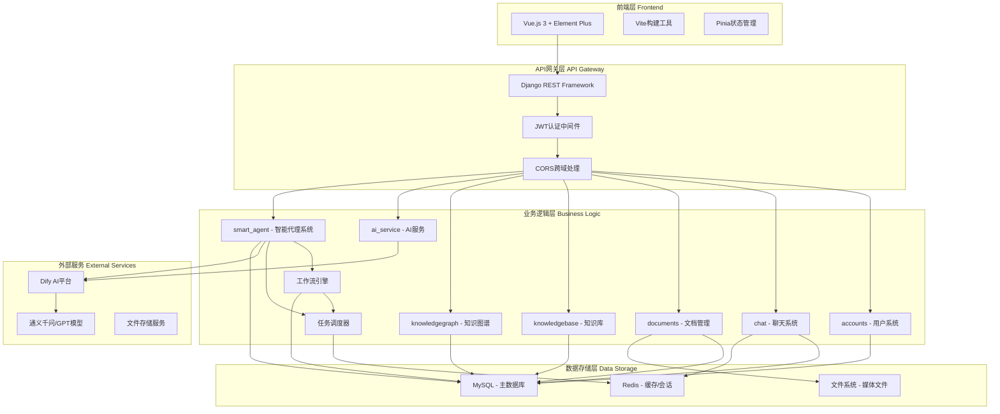
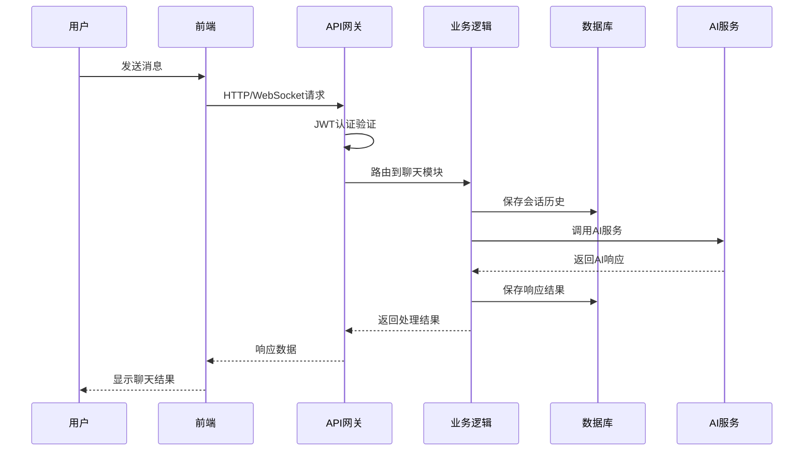

# AI RAG 智能问答系统

## 🎯 项目简介

AI RAG智能问答系统是一个现代化的知识问答平台，结合了检索增强生成（RAG）技术和多种AI大模型，为用户提供智能、准确的问答服务。系统支持文档上传、知识管理、实时聊天等功能，适用于企业知识库、客户服务、学术研究等多种场景。

## ⭐ 核心功能

### 🤖 智能对话系统
- **多模型支持**: 集成通义千问、GPT、Claude、Gemini等主流AI模型
- **会话管理**: 支持多轮对话，自动保存聊天历史
- **实时响应**: 流式输出，提供更好的交互体验
- **上下文理解**: 基于历史对话提供连贯的回答

### 📚 文档知识管理
- **文档上传**: 支持PDF、Word、TXT、CSV等多种文档格式
- **智能分类**: 自动识别文档类型，支持自定义分类和文件夹管理
- **批量操作**: 支持批量上传、删除和分类管理
- **全文搜索**: 快速检索文档内容，精准定位信息
- **权限控制**: 支持文档访问权限设置和分享管理
- **统计分析**: 实时统计文档数量、类型分布和存储使用情况

### 🔗 知识图谱系统
- **CSV数据导入**: 支持CSV文件上传并自动转换为知识图谱数据
- **四级数据链**: 构建原材料→中间体→配方→性能的完整关联体系
- **图谱可视化**: 基于ECharts的交互式知识图谱展示
- **节点详情**: 点击节点查看详细信息，支持多维度数据展示
- **关系追踪**: 追溯材料使用链路，分析配方组成和性能表现
- **数据统计**: 实时统计图谱实体数量和关系分布

### 👥 用户系统
- **用户注册/登录**: 安全的身份认证机制
- **会话隔离**: 每个用户独立的对话空间
- **历史记录**: 完整保存用户的聊天记录和文档操作
- **个人设置**: 自定义AI模型偏好和界面设置

### 🎨 现代化界面
- **响应式设计**: 完美适配桌面端和移动端
- **Material Design**: 采用Element Plus组件，界面美观易用
- **深色模式**: 支持明暗主题切换
- **实时更新**: 页面无刷新更新，流畅的用户体验

### 🤖 AI智能体系统
- **智能任务自动化**: 支持复杂业务流程的自动化执行
- **多智能体协作**: 多个AI代理协同完成复杂任务
- **工作流引擎**: 可视化设计和执行自动化工作流
- **决策支持**: 基于知识图谱的智能决策建议
- **自适应优化**: 根据执行结果自动优化策略
- **实时监控**: 智能体状态监控和性能分析

### 🔗 开放API接口
- **RESTful API**: 标准化的接口设计
- **认证授权**: JWT令牌认证，安全可靠
- **API文档**: 完整的接口文档和调用示例
- **第三方集成**: 易于集成到现有系统中

## 🏗️ 技术架构

一个基于Django后端和Vue.js前端的智能问答系统，采用前后端分离架构，具备高可用、易扩展的特点。

## 系统架构

- **后端**: Django 5.1.3 + Django REST Framework
- **前端**: Vue.js 3 + Element Plus + Vite
- **数据库**: MySQL (生产环境) / SQLite (开发环境)
- **缓存**: Redis
- **AI服务**: 集成Dify API，支持多种AI模型
- **异步服务**: Uvicorn + Gunicorn

## 功能特性

### 🤖 核心AI功能
- **多模型智能对话**: 支持通义千问、GPT、Claude等主流AI模型
- **流式实时响应**: WebSocket连接，实时流式输出对话内容
- **上下文记忆**: 基于会话历史的连续对话能力
- **智能代理系统**: 自动化任务处理和决策支持

### � 文档知识管理
- **多格式文档上传**: 支持PDF、Word、TXT、CSV、Excel等格式
- **智能文档解析**: 自动提取文档结构和关键信息
- **文档分类管理**: 自定义分类体系和标签系统
- **全文检索引擎**: 基于内容的快速文档搜索
- **批量操作处理**: 支持文档的批量上传、分类和删除

### 🕸️ 知识图谱系统
- **CSV数据导入**: 自动解析CSV文件构建知识图谱
- **四级关联数据链**: 原材料→中间体→配方→性能完整链路
- **交互式图谱可视化**: 基于ECharts的动态知识图谱展示
- **节点关系分析**: 深度挖掘实体间的复杂关联关系
- **数据统计分析**: 实时统计图谱规模和分布情况

### � 用户权限系统
- **JWT身份认证**: 安全可靠的用户认证机制
- **角色权限管理**: 多级用户权限和访问控制
- **会话隔离**: 用户间独立的数据和对话空间
- **操作日志**: 完整的用户操作历史记录

### 🎨 现代化界面
- **响应式设计**: 完美适配PC端和移动端设备
- **Material Design**: 基于Element Plus的现代化UI设计
- **主题切换**: 支持明暗主题和个性化定制
- **实时更新**: 无刷新页面更新和实时数据同步

### 🔗 开放API生态
- **RESTful API**: 完整的后端API接口体系
- **GraphQL支持**: 灵活的数据查询接口
- **Webhook集成**: 支持第三方系统事件通知
- **SDK开发包**: 多语言客户端SDK支持

### 🤖 AI智能体系统
- **智能任务执行**: 自动化完成复杂的多步骤任务
- **决策支持引擎**: 基于知识库的智能决策建议
- **工作流自动化**: 可视化工作流设计和执行
- **智能代理调度**: 多智能体协同工作和任务分配
- **自适应学习**: 根据用户反馈优化执行策略
- **任务监控**: 实时监控智能体执行状态和结果

### ⚡ 性能与扩展
- **异步处理**: 基于ASGI的高性能异步服务
- **Redis缓存**: 多层缓存策略提升响应速度
- **MySQL优化**: 数据库连接池和查询优化
- **Docker部署**: 容器化部署支持横向扩展

## 本地启动说明

### 环境要求

- Python 3.13+
- Node.js 18+
- npm 或 yarn

### 1. 克隆项目

```bash
git clone https://github.com/wubo2180/ai_rag_website.git
cd ai_rag_website
```

### 快速启动 (Windows)

项目提供了便捷的批处理脚本：

```bash
# 自动安装所有依赖
install_deps.bat

# 一键启动前后端服务
start_all.bat
```

### 手动启动步骤

### 2. 后端启动

#### 2.1 进入后端目录
```bash
cd backend
```

#### 2.2 创建虚拟环境（推荐）
```bash
python -m venv venv

# Windows
venv\Scripts\activate

# Linux/Mac
source venv/bin/activate
```

#### 2.3 安装依赖
```bash
pip install -r requirements.txt
```

#### 2.4 配置环境变量
创建 `.env` 文件并配置数据库连接：
```bash
# 数据库配置 (MySQL)
DB_ENGINE=django.db.backends.mysql
DB_NAME=ai_rag_db
DB_USER=your_username
DB_PASSWORD=your_password
DB_HOST=localhost
DB_PORT=3306

# 开发环境可使用SQLite
# DB_ENGINE=django.db.backends.sqlite3
# DB_NAME=db.sqlite3

# Redis配置
REDIS_HOST=localhost
REDIS_PORT=6379
REDIS_DB=0

# AI服务配置
DIFY_API_KEY=your_dify_api_key
DIFY_BASE_URL=https://api.dify.ai/v1
```

#### 2.5 数据库初始化
```bash
# 如果使用MySQL，请先创建数据库
# mysql -u root -p
# CREATE DATABASE ai_rag_db CHARACTER SET utf8mb4 COLLATE utf8mb4_unicode_ci;

python manage.py makemigrations
python manage.py migrate
```

#### 2.6 创建超级用户（可选）
```bash
python manage.py createsuperuser
```

#### 2.7 启动后端服务
```bash
# 开发环境 本地启动
python manage.py runserver --settings=config.settings_local

# 生产环境 (使用Uvicorn)
uvicorn config.asgi:application --host 0.0.0.0 --port 8000
```

✅ 后端服务将在 http://127.0.0.1:8000/ 启动

### 3. 前端启动

#### 3.1 新开终端，进入前端目录
```bash
cd frontend
```

#### 3.2 安装依赖
```bash
npm install
# 或者
yarn install
```

#### 3.3 启动开发服务器
```bash
npm run dev
# 或者
yarn dev
```

✅ 前端服务将在 http://localhost:3000/ 启动

### 4. 访问应用

- **前端应用**: http://localhost:3000/
- **后端API**: http://127.0.0.1:8000/api/
- **后端管理后台**: http://127.0.0.1:8000/admin/

## 生产环境部署

### 前置条件
- MySQL 8.0+
- Redis 6.0+
- Python 3.11+
- Node.js 18+

### 1. 数据库准备
```bash
# 创建MySQL数据库
mysql -u root -p
CREATE DATABASE ai_rag_db CHARACTER SET utf8mb4 COLLATE utf8mb4_unicode_ci;
CREATE USER 'ai_rag_user'@'localhost' IDENTIFIED BY 'your_strong_password';
GRANT ALL PRIVILEGES ON ai_rag_db.* TO 'ai_rag_user'@'localhost';
FLUSH PRIVILEGES;
```

### 2. 构建前端
```bash
cd frontend
npm install
npm run build
```

### 3. 配置生产环境
```bash
cd backend

# 安装生产依赖
pip install -r requirements.txt

# 配置环境变量 (生产环境)
cp .env.example .env
# 编辑 .env 文件，设置生产环境配置

# 收集静态文件
python manage.py collectstatic

# 数据库迁移
python manage.py migrate
```

### 4. 启动服务
```bash
# 使用Gunicorn + Uvicorn启动
gunicorn config.asgi:application -w 4 -k uvicorn.workers.UvicornWorker --bind 0.0.0.0:8000

# 或使用Docker
docker-compose up -d
```

生产环境访问: http://your-domain.com/

## API 接口说明

### 🔐 用户认证接口
- **用户注册**: `POST /api/accounts/register/`
- **用户登录**: `POST /api/accounts/login/`
- **令牌刷新**: `POST /api/accounts/token/refresh/`
- **用户信息**: `GET /api/accounts/profile/`
- **退出登录**: `POST /api/accounts/logout/`

### 💬 聊天对话接口
- **发送消息**: `POST /api/chat/chat/`
- **会话管理**: `GET/POST/PUT/DELETE /api/chat/sessions/`
- **消息历史**: `GET /api/chat/messages/`
- **可用模型**: `GET /api/chat/models/`
- **流式对话**: `WebSocket /ws/chat/`

### 📄 文档管理接口
- **文档列表**: `GET /api/documents/`
- **上传文档**: `POST /api/documents/upload/`
- **文档详情**: `GET /api/documents/{id}/`
- **删除文档**: `DELETE /api/documents/{id}/`
- **文档分类**: `GET/POST /api/documents/categories/`
- **文档搜索**: `GET /api/documents/search/`
- **批量操作**: `POST /api/documents/batch/`

### 🧠 知识库接口
- **知识库列表**: `GET /api/knowledgebase/`
- **创建知识库**: `POST /api/knowledgebase/`
- **知识库详情**: `GET /api/knowledgebase/{id}/`
- **知识检索**: `POST /api/knowledgebase/search/`
- **添加知识**: `POST /api/knowledgebase/{id}/add/`

### 🕸️ 知识图谱接口
- **完整图谱**: `GET /api/knowledgegraph/full_graph/`
- **节点详情**: `GET /api/knowledgegraph/nodes/{id}/`
- **关系查询**: `GET /api/knowledgegraph/relations/`
- **CSV处理**: `POST /api/knowledgegraph/process-csv/`
- **图谱统计**: `GET /api/knowledgegraph/stats/`
- **实体搜索**: `GET /api/knowledgegraph/search/`

### 🤖 AI服务接口
- **模型列表**: `GET /api/ai_service/models/`
- **文本生成**: `POST /api/ai_service/generate/`
- **文档分析**: `POST /api/ai_service/analyze/`
- **智能摘要**: `POST /api/ai_service/summarize/`
- **情感分析**: `POST /api/ai_service/sentiment/`

### 🤖 智能体接口
- **智能体列表**: `GET /api/smart_agent/agents/`
- **创建智能体**: `POST /api/smart_agent/create/`
- **执行任务**: `POST /api/smart_agent/execute/`
- **任务状态**: `GET /api/smart_agent/tasks/{id}/status/`
- **工作流管理**: `GET/POST /api/smart_agent/workflows/`
- **智能体配置**: `PUT /api/smart_agent/agents/{id}/config/`
- **执行历史**: `GET /api/smart_agent/history/`
- **性能监控**: `GET /api/smart_agent/metrics/`

### 🔧 系统管理接口
- **系统状态**: `GET /api/system/status/`
- **日志查询**: `GET /api/system/logs/`
- **配置管理**: `GET/POST /api/system/config/`
- **性能监控**: `GET /api/system/metrics/`

## 📋 应用模块详解

### 1. accounts - 用户认证系统
**功能**: 用户注册、登录、权限管理
**核心文件**:
- `models.py`: 用户模型和权限定义
- `api_views.py`: 认证API视图
- `serializers.py`: 数据序列化器
- `management/`: 用户管理命令

### 2. ai_service - AI服务集成
**功能**: 集成外部AI服务(如Dify)，提供统一的AI能力接口
**核心功能**:
- 多AI模型管理和切换
- 文本生成和对话处理
- 文档智能分析
- AI能力统一封装

### 3. chat - 智能聊天系统
**功能**: 实时聊天、会话管理、消息存储
**核心功能**:
- WebSocket实时通信
- 会话上下文管理
- 消息历史存储
- 多轮对话支持

### 4. documents - 文档管理系统
**功能**: 文件上传、存储、分类、搜索
**核心功能**:
- 多格式文件解析
- 文档分类和标签
- 全文搜索索引
- 批量操作处理

### 5. knowledgebase - 知识库管理
**功能**: 结构化知识存储和检索
**核心功能**:
- 知识条目管理
- 智能知识检索
- 知识关联分析
- 知识库统计

### 6. knowledgegraph - 知识图谱系统
**功能**: 图谱数据建模、可视化、分析
**核心功能**:
- 实体关系建模
- CSV数据自动导入
- 图谱可视化渲染
- 复杂关系查询

### 7. smart_agent - AI智能体系统
**功能**: 智能代理管理、任务自动化执行、工作流编排
**核心功能**:
- **智能体生命周期管理**: 创建、配置、启动、停止智能体
- **任务自动化执行**: 支持复杂的多步骤任务自动执行
- **工作流引擎**: 可视化工作流设计器和执行引擎
- **多智能体协作**: 智能体间的通信和协作机制
- **决策支持系统**: 基于规则和AI的智能决策
- **执行监控**: 实时监控智能体状态和任务执行进度
- **策略优化**: 基于执行结果的自动策略调整
- **知识集成**: 与知识库和知识图谱的深度集成
**核心文件**:
- `models.py`: 智能体模型、任务模型、工作流模型
- `views.py`: 智能体管理API视图
- `workflow_engine.py`: 工作流执行引擎
- `agent_manager.py`: 智能体生命周期管理
- `task_executor.py`: 任务执行器

### 聊天API示例

```json
POST /api/chat/chat/
{
    "message": "你好，请介绍一下这个系统",
    "session_id": 20,  // 可选，不提供则创建新会话
    "model": "通义千问"  // 可选，使用指定AI模型
}
```

### CSV转知识图谱API示例

```json
POST /api/kg/process-csv-documents/
{
    "document_ids": [1, 2, 3]  // CSV文档ID列表
}

// 响应示例
{
    "message": "处理完成，共处理3个文件，成功2个",
    "total_processed": 3,
    "successful": 2,
    "results": [
        {
            "document_id": 1,
            "success": true,
            "materials_created": 5,
            "intermediates_created": 3,
            "formulas_created": 2,
            "performances_created": 8
        }
    ]
}
```

### 智能体执行API示例

```json
// 创建智能体
POST /api/smart_agent/create/
{
    "name": "文档分析助手",
    "description": "自动分析上传的文档并生成摘要",
    "type": "document_analyzer",
    "config": {
        "auto_start": true,
        "max_concurrent_tasks": 3,
        "timeout": 300
    }
}

// 执行智能体任务
POST /api/smart_agent/execute/
{
    "agent_id": "doc_analyzer_001",
    "task_type": "analyze_documents",
    "parameters": {
        "document_ids": [1, 2, 3],
        "analysis_depth": "detailed",
        "output_format": "summary"
    },
    "priority": "high"
}

// 响应示例
{
    "task_id": "task_12345",
    "agent_id": "doc_analyzer_001",
    "status": "running",
    "created_at": "2025-11-05T10:30:00Z",
    "estimated_completion": "2025-11-05T10:35:00Z",
    "progress": {
        "current_step": "文档解析中",
        "completed_percentage": 25,
        "steps_total": 4,
        "steps_completed": 1
    }
}

// 查询任务状态
GET /api/smart_agent/tasks/task_12345/status/
{
    "task_id": "task_12345",
    "status": "completed",
    "result": {
        "documents_processed": 3,
        "summaries_generated": 3,
        "execution_time": "45s",
        "output_files": [
            {"document_id": 1, "summary": "文档1摘要内容...", "keywords": ["关键词1", "关键词2"]},
            {"document_id": 2, "summary": "文档2摘要内容...", "keywords": ["关键词3", "关键词4"]},
            {"document_id": 3, "summary": "文档3摘要内容...", "keywords": ["关键词5", "关键词6"]}
        ]
    }
}
```

## 目录结构

```
ai_rag_website/
├── backend/                     # Django后端服务
│   ├── config/                 # Django项目配置
│   │   ├── settings/           # 环境配置文件
│   │   ├── __init__.py
│   │   ├── asgi.py            # ASGI配置
│   │   ├── wsgi.py            # WSGI配置
│   │   └── urls.py            # 根URL配置
│   ├── apps/                   # 应用模块
│   │   ├── accounts/          # 用户认证和权限管理
│   │   ├── ai_service/        # AI服务集成 (Dify API)
│   │   ├── chat/              # 智能聊天功能
│   │   ├── documents/         # 文档管理系统
│   │   ├── knowledgebase/     # 知识库管理
│   │   ├── knowledgegraph/    # 知识图谱系统
│   │   └── smart_agent/       # 智能代理功能
│   ├── utils/                 # 公共工具函数
│   ├── scripts/               # 脚本工具
│   ├── media/                 # 用户上传文件
│   ├── static/                # 静态文件
│   ├── staticfiles/           # 收集的静态文件
│   ├── templates/             # HTML模板
│   ├── logs/                  # 日志文件
│   ├── nginx/                 # Nginx配置
│   ├── test/                  # 测试文件
│   ├── .env                   # 环境变量配置
│   ├── .env.dev               # 开发环境配置
│   ├── Dockerfile             # Docker镜像构建
│   ├── docker-compose.yml     # Docker编排配置
│   ├── manage.py              # Django管理脚本
│   └── requirements.txt       # Python依赖包
│
├── frontend/                   # Vue.js前端应用
│   ├── src/
│   │   ├── components/        # 可复用组件
│   │   │   ├── chat/         # 聊天相关组件
│   │   │   ├── documents/    # 文档管理组件
│   │   │   ├── knowledge/    # 知识图谱组件
│   │   │   ├── smart-agent/  # 智能体相关组件
│   │   │   └── common/       # 通用组件
│   │   ├── views/            # 页面视图组件
│   │   │   ├── Chat.vue      # 智能聊天页面
│   │   │   ├── Documents.vue # 文档管理页面
│   │   │   ├── KnowledgeGraph.vue # 知识图谱页面
│   │   │   ├── SmartAgent.vue # 智能体管理页面
│   │   │   ├── WorkflowDesigner.vue # 工作流设计页面
│   │   │   ├── Login.vue     # 用户登录页面
│   │   │   └── Dashboard.vue # 仪表盘页面
│   │   ├── stores/           # Pinia状态管理
│   │   ├── services/         # API服务层
│   │   ├── router/           # Vue Router路由配置
│   │   ├── utils/            # 前端工具函数
│   │   ├── assets/           # 静态资源
│   │   ├── App.vue           # 根组件
│   │   └── main.js           # 应用入口
│   ├── public/               # 公共静态文件
│   ├── dist/                 # 构建输出目录
│   ├── .vscode/              # VS Code配置
│   ├── package.json          # npm依赖配置
│   ├── vite.config.js        # Vite构建配置
│   └── index.html            # HTML入口文件
│
├── docs/                      # 项目文档
│   ├── api/                  # API接口文档
│   ├── deployment/           # 部署文档
│   ├── development/          # 开发文档
│   ├── features/             # 功能说明文档
│   └── guides/               # 使用指南
│
├── test/                      # 端到端测试
│   ├── backend/              # 后端测试
│   ├── frontend/             # 前端测试
│   └── integration/          # 集成测试
│
├── .git/                      # Git版本控制
├── install_deps.bat           # 依赖安装脚本 (Windows)
├── start_all.bat             # 启动脚本 (Windows)
└── README.md                 # 项目说明文档
```

## 常见问题

### 1. 静态文件无法加载
确保运行了 `npm run build` 并且Django的静态文件配置正确。

### 2. CORS错误
检查Django的CORS设置，确保前端域名在允许列表中。

### 3. AI服务连接失败
检查AI服务配置，确保API密钥和服务地址正确。

### 4. 数据库连接错误
```bash
# 检查MySQL服务是否启动
sudo systemctl status mysql

# 检查数据库配置
python manage.py dbshell

# 重新运行迁移
python manage.py makemigrations
python manage.py migrate
```

### 5. MySQL客户端安装失败
```bash
# Ubuntu/Debian
sudo apt-get install default-libmysqlclient-dev

# CentOS/RHEL
sudo yum install mysql-devel

# macOS
brew install mysql

# Windows - 使用预编译包
pip install --only-binary=mysqlclient mysqlclient
```

### 6. Redis连接错误
```bash
# 检查Redis服务
redis-cli ping

# 启动Redis服务
sudo systemctl start redis
```

## 开发说明

- 后端开发服务器支持热重载
- 前端支持热模块替换(HMR)
- API文档可通过Django REST Framework浏览器界面查看
- 推荐使用虚拟环境隔离Python依赖

## 技术栈详情

### 后端技术栈
- **Django 5.1.3**: Web框架
- **Django REST Framework**: RESTful API框架
- **MySQL**: 主要数据库 (mysqlclient驱动)
- **Redis**: 缓存和会话存储
- **Uvicorn/Gunicorn**: 异步ASGI服务器
- **Celery**: 异步任务队列
- **JWT**: 身份认证

### 前端技术栈
- **Vue.js 3**: 前端框架
- **Element Plus**: UI组件库
- **Vite**: 前端构建工具
- **Pinia**: 状态管理
- **Axios**: HTTP客户端
- **ECharts**: 数据可视化

### 开发工具
- **Django Debug Toolbar**: 调试工具
- **Rich**: 终端美化
- **Structlog**: 结构化日志
- **python-dotenv**: 环境变量管理

## 🏗️ 系统架构图



## 🔄 数据流程图



## 数据库迁移说明

### 从PostgreSQL迁移到MySQL

如果您之前使用的是PostgreSQL版本，现在需要迁移到MySQL：

1. **导出现有数据**
```bash
# 使用Django命令导出数据
python manage.py dumpdata --natural-foreign --natural-primary -e contenttypes -e auth.Permission > data_backup.json
```

2. **更新配置**
```bash
# 更新 .env 文件中的数据库配置
DB_ENGINE=django.db.backends.mysql
DB_NAME=ai_rag_db
DB_USER=your_mysql_user
DB_PASSWORD=your_mysql_password
```

3. **重新初始化数据库**
```bash
# 删除迁移文件 (保留__init__.py)
find . -path "*/migrations/*.py" -not -name "__init__.py" -delete
find . -path "*/migrations/*.pyc" -delete

# 重新生成迁移
python manage.py makemigrations
python manage.py migrate

# 导入数据
python manage.py loaddata data_backup.json
```

### OCR 迁移基线与去重策略（2026-05 更新）

本项目在 `ocr` 模块已完成迁移基线收敛与上传去重增强，建议按以下流程校验：

1. **执行迁移**
```bash
python manage.py migrate
```

2. **确认关键迁移状态**
```bash
python manage.py showmigrations ocr ai_service
```

3. **确认模型与迁移一致**
```bash
python manage.py makemigrations --check --dry-run
```

4. **确认 `files.sha256_hash` 字段已落库（可选）**
```bash
python manage.py shell -c "from django.db import connection; cols=[c.name for c in connection.introspection.get_table_description(connection.cursor(),'files')]; print('sha256_hash' in cols)"
```

#### OCR 上传去重规则

- 主要判定键：`sha256_hash + file_size`
- 同批次内重复：自动跳过并标记 `duplicate_in_batch`
- 历史数据兼容：当历史记录无 `sha256_hash` 时，回退 `md5_hash + file_size` 判定
- 上传返回体新增：`duplicates`、`duplicate_count`

#### 相关迁移文件

- `backend/apps/ocr/migrations/0001_add_sha256_hash_to_files.py`
- `backend/apps/ocr/migrations/0002_initial.py`
- `backend/apps/ocr/migrations/0003_ensure_sha256_hash_column.py`
- `backend/apps/ai_service/migrations/0002_rename_ai_service__user_id_313cb6_idx_ai_service__user_id_685b62_idx.py`

### 性能优化建议

1. **MySQL配置优化**
```sql
-- 在my.cnf中添加
[mysqld]
innodb_buffer_pool_size = 1G
innodb_log_file_size = 256M
max_connections = 1000
query_cache_type = 1
query_cache_size = 64M
```

2. **Redis配置**
```bash
# 在redis.conf中配置
maxmemory 512mb
maxmemory-policy allkeys-lru
```

3. **Django设置**
```python
# settings.py 中的数据库连接池配置
DATABASES = {
    'default': {
        # ... 其他配置
        'OPTIONS': {
            'charset': 'utf8mb4',
            'init_command': "SET sql_mode='STRICT_TRANS_TABLES'",
        },
        'CONN_MAX_AGE': 600,  # 连接池
    }
}
```

## 版本更新日志

### v2.1.0 (2026-05-25)
- ✅ 完成 OCR 上传去重增强（`sha256_hash + file_size`）
- ♻️ 兼容历史 `md5_hash` 数据，避免存量数据切换期误判
- 🧩 修复 `makemigrations` 在 `ocr` 模块的迁移状态图异常
- 🗂️ 收敛 `ocr` 迁移基线并补充 `sha256_hash` 安全落库迁移
- 📌 新增 README 中 OCR 迁移校验与排障说明

### v2.0.0 (2025-11-05)
- 🔄 数据库从PostgreSQL迁移到MySQL
- ⬆️ 更新Django到5.1.3
- 🚀 集成异步服务器支持 (Uvicorn)
- 📈 添加Redis缓存支持
- 🤖 新增AI智能体系统 (Smart Agent)
- 🔧 智能工作流引擎和任务自动化
- 📊 智能体性能监控和分析
- 🛠️ 更新所有依赖包到最新稳定版本
- 📝 完善部署文档和故障排除指南

### v1.0.0
- 🎉 初始版本发布
- 🤖 基础AI问答功能
- 📚 文档管理系统
- 🕸️ 知识图谱功能

---

如有问题，请查看控制台输出或联系开发团队。